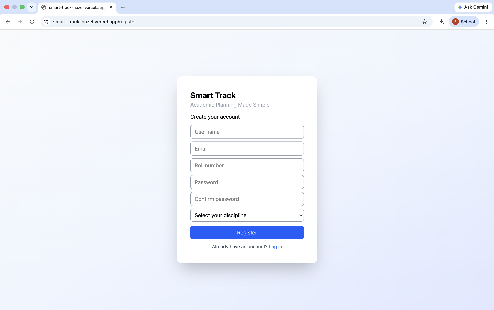
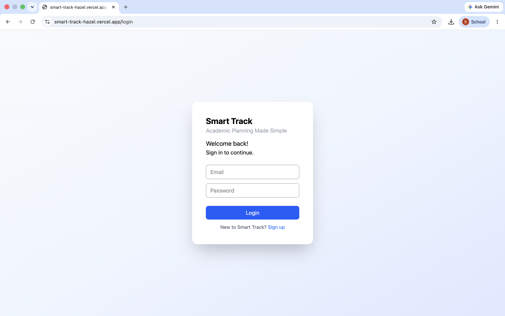
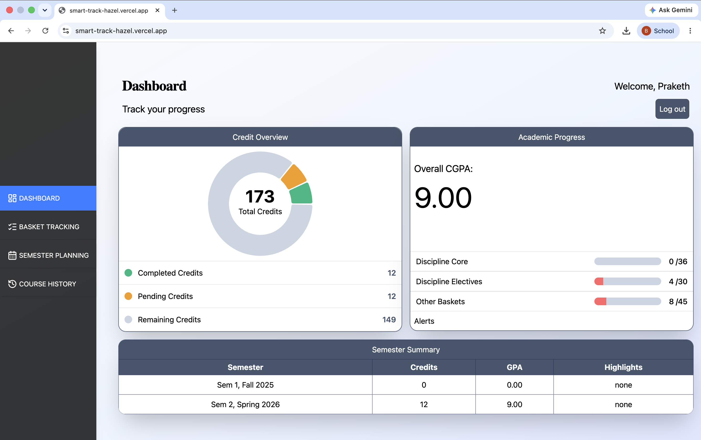
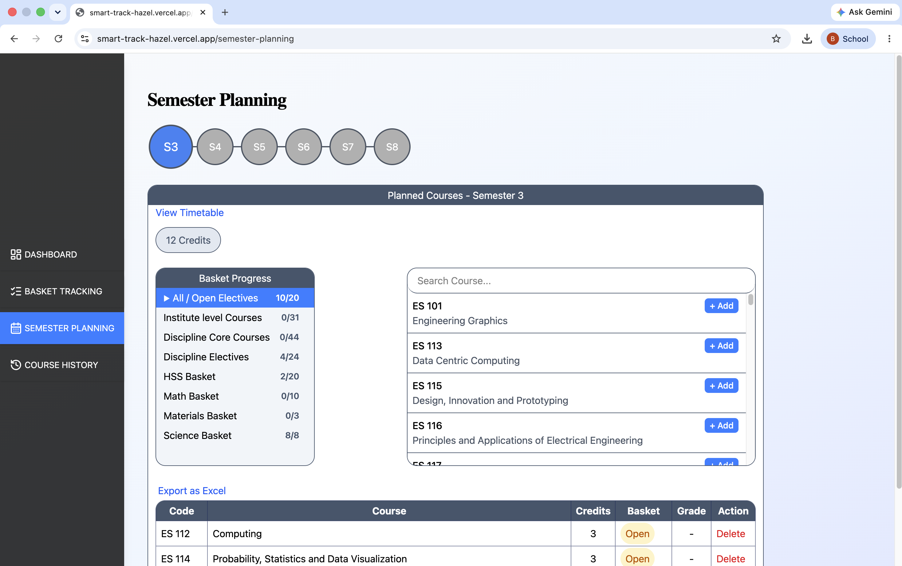
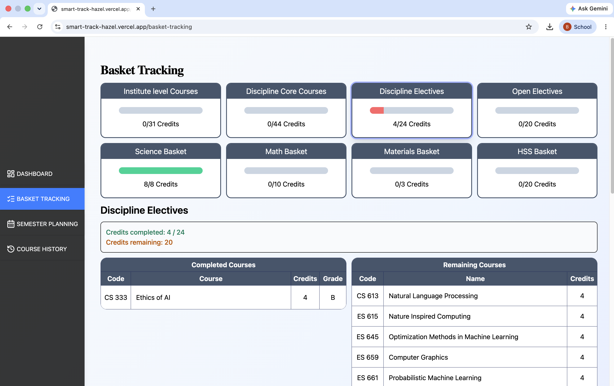
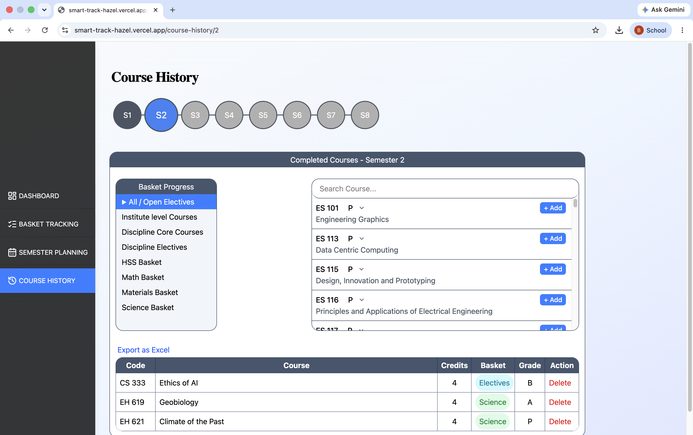
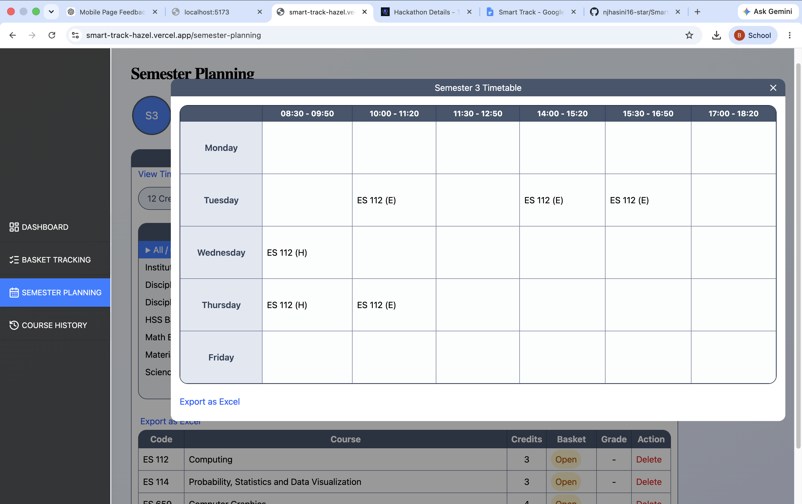
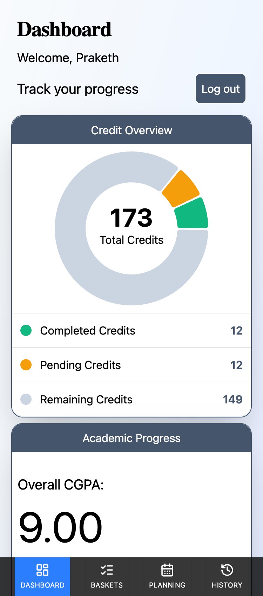
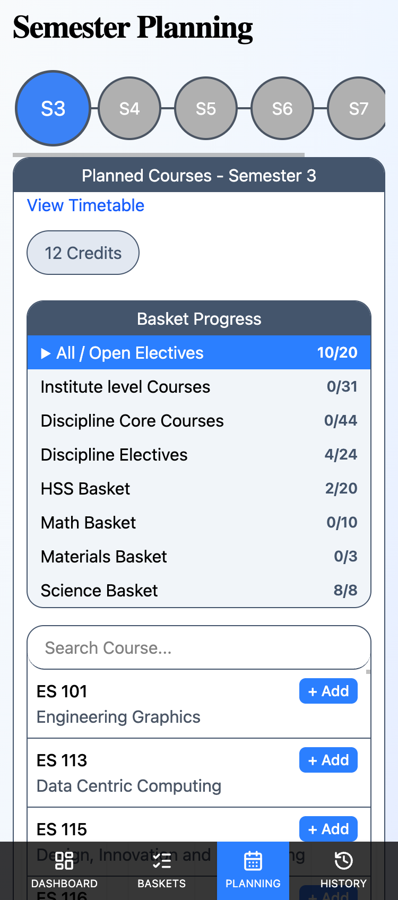
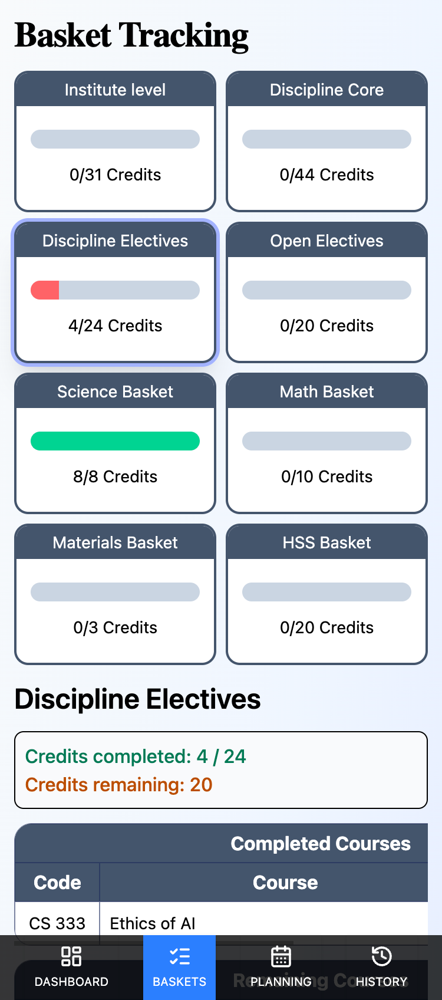

# SmartTrack

A full-stack web application that helps IIT Gandhinagar students track graduation requirements, plan future semesters, and visualise their academic progress.

## Features
- JWT-based authentication
- Dashboard with credit and CGPA analytics
- Semester planning
- Basket-wise graduation tracking
- Timetable integration with conflict detection
- Course history management
- Responsive UI for desktop and mobile

## Tech Stack
Frontend:
- React
- Vite
- Tailwind CSS
- React Router

Backend:
- Node.js
- Express.js

Database:
- PostgreSQL

Authentication:
- JWT
- HTTP-only Cookies

## Screenshots

  
  

  
  

  
  

  

  
  
  

